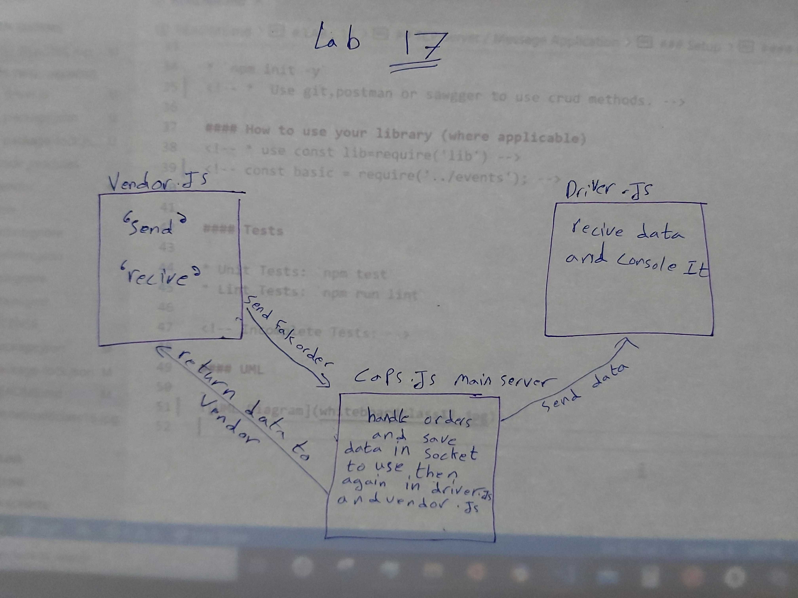

# LAB - 17
<!-- ## Project: Project Name Here -->
## TCP Server / Message Application

### Author: Abdallah Obaid

### Links and Resources

* [submission PR](https://github.com/Abdallah-401-advanced-javascript/caps/pull/1)
* [travis](https://github.com/Abdallah-401-advanced-javascript/caps/pull/1/checks?check_run_id=771355453)
* [ci/cd](https://github.com/Abdallah-401-advanced-javascript/caps/pull/1/checks?check_run_id=771358031)
<!-- - [back-end server url](http://xyz.com) (when applicable) -->
<!-- * [front-end application](https://abdallah-lab-00.herokuapp.com/)  -->

### Documentation
<!-- * [jsdoc](https://abdallah-lab-00.herokuapp.com/docs/) -->
<!-- * [swagger](https://app.swaggerhub.com/apis/AbdallahObaid/class-06/0.1)  -->

### Modules
<!-- #### `events.js`. -->
##### Exported Values and Methods

<!-- ###### `events.js`
This is to require the event and use it in the other files. -->

### Setup

#### `.env` requirements 
PORT=3030 // not used yet
storeName=AbuAlFalafel

#### How to initialize/run your application 

* `npm init -y`
<!-- *  Use git,postman or sawgger to use crud methods. -->

#### How to use your library (where applicable)
<!-- * use const lib=require('lib') -->
<!-- const basic = require('../events'); -->

#### Tests

* Unit Tests: `npm test`
* Lint Tests: `npm run lint`

<!-- Incomplete Tests: -->

#### UML

